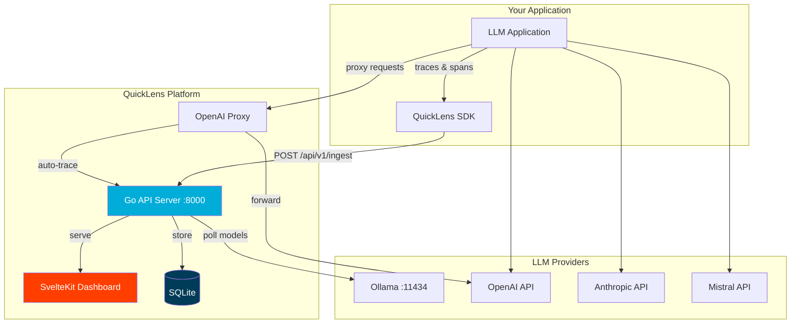

# QuickLens — Comprehensive Guide

> Complete reference for deploying, configuring, and integrating QuickLens into your LLM stack.

---

## Table of Contents

- [Overview](#overview)
- [Architecture](#architecture)
- [Quick Start](#quick-start)
- [Features](#features)
  - [Model Monitoring](#1-model-monitoring)
  - [Token & Cost Tracking](#2-token--cost-tracking)
  - [Distributed Tracing](#3-distributed-tracing)
  - [Prompt Library](#4-prompt-library)
  - [Live Log Viewer](#5-live-log-viewer)
  - [Evaluation & Scoring](#6-evaluation--scoring)
  - [Configurable Alerts](#7-configurable-alerts)
- [Integration Guide](#integration-guide)
  - [Python SDK](#python-sdk)
  - [TypeScript SDK](#typescript-sdk)
  - [Proxy Mode](#proxy-mode)
  - [Ollama Integration](#ollama-integration)
  - [MCP Server](#mcp-server)
- [API Reference](#api-reference)
- [Configuration Reference](#configuration-reference)
- [Troubleshooting](#troubleshooting)

---

## Overview

QuickLens is a lightweight, self-hosted LLM observability platform that gives developers full visibility into their AI applications. It captures every LLM interaction — traces, tokens, costs, prompts, and evaluations — in a single dashboard that runs anywhere Docker runs.

**Key principles:**

- **Zero-configuration**: SQLite by default, no external databases required
- **Privacy-first**: All data stays on your infrastructure
- **Developer-friendly**: SDKs, proxy mode, and MCP integration
- **Lightweight**: ~25 MB container image, <128 MB RAM

---

## Architecture



### How It Works

1. **Ingest**: Your application sends trace data via the SDK, or routes requests through the proxy
2. **Store**: The Go backend persists traces, spans, and metrics to SQLite
3. **Visualize**: The SvelteKit dashboard renders real-time charts, trace waterfalls, and cost breakdowns
4. **Alert**: Background workers evaluate alert rules and fire notifications when thresholds are breached

---

## Quick Start

### Prerequisites

- Docker 24+ and Docker Compose v2
- (Optional) Ollama for local model monitoring

### Step 1: Clone & Configure

```bash
git clone https://github.com/quicklens/quicklens.git
cd quicklens
cp .env.example .env
```

### Step 2: Launch

```bash
docker compose up -d
```

### Step 3: Open Dashboard

Navigate to **http://localhost** and log in:

| Field    | Value                  |
|----------|------------------------|
| Email    | `admin@quicklens.local` |
| Password | `admin`                |

### Step 4: Send Your First Trace

```python
from quicklens import QuickLensClient

client = QuickLensClient("http://localhost", api_key="ql-dev")
trace = client.create_trace(name="hello-world")
trace.add_span(
    name="greeting",
    model="gpt-4o",
    input_text="Say hello",
    output_text="Hello, world!",
    tokens={"input": 10, "output": 5}
)
trace.end()
```

---

## Features

### 1. Model Monitoring

Track every LLM model your application uses across all providers.

**Capabilities:**
- Auto-discover models from a local Ollama instance (polls every 30s by default)
- Register cloud provider endpoints (OpenAI, Anthropic, Mistral, Cohere, Google)
- View per-model health metrics: request count, error rate, P50/P95/P99 latency
- Model comparison dashboards for A/B testing

**Dashboard panels:**
- Model Registry — all known models with status indicators
- Health Matrix — latency and error rate heatmap
- Model Activity — requests per model over time

### 2. Token & Cost Tracking

Understand exactly how much your LLM usage costs.

**Capabilities:**
- Configurable price tables with per-model input/output token rates
- Real-time cost accumulator with daily, weekly, and monthly rollups
- Budget thresholds with alerts when spend exceeds limits
- Cost attribution by session, user, or feature

**Configuring price tables:**

```
Dashboard → Settings → Cost Configuration
```

| Model | Input ($/1M tokens) | Output ($/1M tokens) |
|-------|---------------------|----------------------|
| gpt-4o | $2.50 | $10.00 |
| gpt-4o-mini | $0.15 | $0.60 |
| claude-3.5-sonnet | $3.00 | $15.00 |
| llama3.1:8b | $0.00 | $0.00 |

### 3. Distributed Tracing

Visualize the full lifecycle of LLM chains, agents, and RAG pipelines.

**Capabilities:**
- Nested span trees with parent-child relationships
- Latency waterfall visualization
- Input/output inspection for every span
- Session grouping for multi-turn conversations
- Span metadata (model, tokens, cost, status)

**Trace structure:**

```
Trace: "customer-support-agent"
├── Span: "retrieve-context" (1.2s)
│   ├── Span: "embed-query" (0.1s) — text-embedding-3-small
│   └── Span: "vector-search" (1.1s)
├── Span: "generate-response" (2.3s) — gpt-4o
│   ├── input_tokens: 1,250
│   ├── output_tokens: 340
│   └── cost: $0.0065
└── Span: "safety-check" (0.4s) — gpt-4o-mini
```

### 4. Prompt Library

Version-control your prompts and track how they evolve.

**Capabilities:**
- Create and organize prompt templates with tags
- Automatic versioning on every edit
- Side-by-side diff view between versions
- Link prompts to traces to see real-world performance
- Import/export as JSON

**Example workflow:**

1. Create a prompt template: "customer-greeting-v1"
2. Edit the system message → auto-creates v2
3. Compare v1 vs v2 in the diff viewer
4. Check traces to see which version performs better

### 5. Live Log Viewer

Stream LLM requests in real-time as they flow through your application.

**Capabilities:**
- WebSocket-powered real-time log feed
- Filter by model, status code, session ID, time range
- Click any log entry to jump to its full trace
- Pause/resume streaming
- Export filtered logs as JSON or CSV

### 6. Evaluation & Scoring

Measure LLM output quality with human and automated feedback.

**Capabilities:**
- Thumbs up/down feedback on individual responses
- Latency SLO tracking (define target latencies per endpoint)
- Custom scoring dimensions (relevance, accuracy, helpfulness)
- Aggregate scores per model, prompt version, or time period

**SLO configuration:**

```
Dashboard → Settings → SLO Targets
```

| Metric | Target | Window |
|--------|--------|--------|
| P95 Latency | < 3s | 24h |
| Error Rate | < 1% | 1h |
| User Satisfaction | > 85% | 7d |

### 7. Configurable Alerts

Get notified when your LLM stack misbehaves.

**Capabilities:**
- Cost alerts: "Notify when daily spend exceeds $50"
- Error rate alerts: "Notify when error rate exceeds 5% in 15 minutes"
- Latency alerts: "Notify when P95 latency exceeds 5 seconds"
- Custom webhook destinations
- Alert history and acknowledgment tracking

---

## Integration Guide

### Python SDK

Install the SDK:

```bash
pip install quicklens-sdk
```

**Basic tracing:**

```python
from quicklens import QuickLensClient

client = QuickLensClient(
    base_url="http://localhost",
    api_key="ql-your-api-key"
)

# Create a trace with spans
trace = client.create_trace(name="summarization-pipeline")

trace.add_span(
    name="embed",
    model="text-embedding-3-small",
    input_text="Document to summarize...",
    tokens={"input": 500}
)

trace.add_span(
    name="generate",
    model="gpt-4o",
    input_text="Summarize the following...",
    output_text="Here is the summary...",
    tokens={"input": 1200, "output": 300},
    cost=0.0045
)

trace.end()
```

**Decorator-based tracing:**

```python
from quicklens import QuickLensClient, quicklens_trace

client = QuickLensClient("http://localhost", api_key="ql-...")

@quicklens_trace(client, name="analyze")
def analyze_sentiment(text: str) -> dict:
    # Your LLM call here
    return {"sentiment": "positive", "confidence": 0.95}

result = analyze_sentiment("I love this product!")
# Trace automatically sent with timing, input args, and return value
```

**OpenAI wrapper:**

```python
from openai import OpenAI
from quicklens import QuickLensClient
from quicklens.wrappers import wrap_openai

ql = QuickLensClient("http://localhost", api_key="ql-...")
openai_client = wrap_openai(OpenAI(), ql)

# All calls are automatically traced
response = openai_client.chat.completions.create(
    model="gpt-4o",
    messages=[{"role": "user", "content": "Hello!"}]
)
```

### TypeScript SDK

Install the SDK:

```bash
npm install quicklens-sdk
```

**Basic usage:**

```typescript
import { QuickLensClient } from 'quicklens-sdk';

const ql = new QuickLensClient({
  baseUrl: 'http://localhost',
  apiKey: 'ql-your-api-key'
});

const trace = ql.createTrace({ name: 'chat-flow' });

trace.addSpan({
  name: 'openai-completion',
  model: 'gpt-4o',
  input: 'What is the meaning of life?',
  output: '42, according to Douglas Adams.',
  tokens: { input: 12, output: 8 },
});

await trace.end();
```

**OpenAI wrapper:**

```typescript
import OpenAI from 'openai';
import { QuickLensClient, wrapOpenAI } from 'quicklens-sdk';

const ql = new QuickLensClient({ baseUrl: 'http://localhost', apiKey: 'ql-...' });
const openai = wrapOpenAI(new OpenAI(), ql);

// Automatically traced
const response = await openai.chat.completions.create({
  model: 'gpt-4o',
  messages: [{ role: 'user', content: 'Hello!' }]
});
```

### Proxy Mode

Route all LLM traffic through QuickLens for automatic tracing without any SDK changes.

**Setup:**

```bash
# Point your OpenAI client to the QuickLens proxy
export OPENAI_BASE_URL=http://localhost/proxy/openai/v1
export OPENAI_API_KEY=sk-your-real-key
```

QuickLens transparently forwards requests to the upstream provider, captures traces with full token/cost metadata, and returns the unmodified response.

**Supported providers:**

| Provider | Proxy URL |
|----------|-----------|
| OpenAI | `http://localhost/proxy/openai/v1` |
| Anthropic | `http://localhost/proxy/anthropic/v1` |
| Mistral | `http://localhost/proxy/mistral/v1` |

### Ollama Integration

QuickLens auto-discovers models from your local Ollama instance:

1. Ensure Ollama is running on `localhost:11434`
2. QuickLens polls `GET /api/tags` every 30 seconds (configurable via `OLLAMA_POLL_INTERVAL`)
3. Discovered models appear in the Model Registry automatically

For Docker environments, QuickLens connects via `host.docker.internal:11434`. To run Ollama as a Docker service:

```bash
docker compose --profile ollama up -d
```

### MCP Server

The MCP server lets AI assistants query your QuickLens data:

**Configuration (Claude Desktop, Cursor, etc.):**

```json
{
  "mcpServers": {
    "quicklens": {
      "command": "python",
      "args": ["-m", "mcp.server"],
      "cwd": "/path/to/quicklens",
      "env": {
        "QUICKLENS_URL": "http://localhost",
        "QUICKLENS_API_KEY": "ql-your-api-key"
      }
    }
  }
}
```

**Available tools:**

| Tool | Description |
|------|-------------|
| `search_traces` | Search traces by name, model, status, or time range |
| `get_trace_detail` | Get full trace with all spans |
| `list_sessions` | List conversation sessions |
| `list_models` | List all registered models |
| `get_model_health` | Get health metrics for a model |
| `list_prompts` | List prompt templates |
| `get_prompt` | Get prompt content and version history |
| `get_token_metrics` | Get token usage statistics |
| `get_cost_summary` | Get cost breakdown by model/period |
| `get_dashboard_summary` | Get overview metrics |
| `get_system_status` | Check system health |

---

## API Reference

All API endpoints are prefixed with `/api/v1`. Authentication via `Authorization: Bearer <token>` header.

### Authentication

| Method | Path | Description |
|--------|------|-------------|
| `POST` | `/api/v1/auth/login` | Log in with email/password, returns JWT |
| `POST` | `/api/v1/auth/register` | Register a new account (if enabled) |
| `GET` | `/api/v1/auth/me` | Get current user profile |

**Login request:**

```json
{
  "email": "admin@quicklens.local",
  "password": "admin"
}
```

**Login response:**

```json
{
  "token": "eyJhbG...",
  "user": {
    "id": "usr_abc123",
    "email": "admin@quicklens.local",
    "role": "admin"
  }
}
```

### Traces

| Method | Path | Description |
|--------|------|-------------|
| `GET` | `/api/v1/traces` | List traces (paginated, filterable) |
| `GET` | `/api/v1/traces/:id` | Get trace with all spans |
| `POST` | `/api/v1/ingest/traces` | Ingest a new trace (SDK endpoint) |
| `DELETE` | `/api/v1/traces/:id` | Delete a trace |

**Query parameters for `GET /api/v1/traces`:**

| Param | Type | Description |
|-------|------|-------------|
| `page` | int | Page number (default: 1) |
| `limit` | int | Results per page (default: 50, max: 200) |
| `search` | string | Search by trace name |
| `model` | string | Filter by model name |
| `status` | string | Filter by status (`ok`, `error`) |
| `session_id` | string | Filter by session |
| `from` | ISO 8601 | Start time filter |
| `to` | ISO 8601 | End time filter |

### Models

| Method | Path | Description |
|--------|------|-------------|
| `GET` | `/api/v1/models` | List all registered models |
| `GET` | `/api/v1/models/:id` | Get model details and health |
| `POST` | `/api/v1/models` | Register a model manually |
| `PUT` | `/api/v1/models/:id` | Update model configuration |
| `DELETE` | `/api/v1/models/:id` | Remove a model |

### Prompts

| Method | Path | Description |
|--------|------|-------------|
| `GET` | `/api/v1/prompts` | List prompt templates |
| `GET` | `/api/v1/prompts/:id` | Get prompt with version history |
| `POST` | `/api/v1/prompts` | Create a new prompt |
| `PUT` | `/api/v1/prompts/:id` | Update prompt (auto-versions) |
| `DELETE` | `/api/v1/prompts/:id` | Delete a prompt |
| `GET` | `/api/v1/prompts/:id/versions` | List all versions |
| `GET` | `/api/v1/prompts/:id/diff` | Diff two versions (`?v1=1&v2=2`) |

### Metrics

| Method | Path | Description |
|--------|------|-------------|
| `GET` | `/api/v1/metrics/tokens` | Token usage over time |
| `GET` | `/api/v1/metrics/costs` | Cost breakdown by model/period |
| `GET` | `/api/v1/metrics/latency` | Latency percentiles over time |
| `GET` | `/api/v1/metrics/dashboard` | Aggregated dashboard summary |

**Query parameters:**

| Param | Type | Description |
|-------|------|-------------|
| `period` | string | `hour`, `day`, `week`, `month` |
| `model` | string | Filter by model name |
| `from` | ISO 8601 | Start time |
| `to` | ISO 8601 | End time |

### Evaluations

| Method | Path | Description |
|--------|------|-------------|
| `POST` | `/api/v1/evaluations` | Submit a score for a span |
| `GET` | `/api/v1/evaluations` | List evaluations (filterable) |
| `GET` | `/api/v1/evaluations/summary` | Aggregate scores |

### Alerts

| Method | Path | Description |
|--------|------|-------------|
| `GET` | `/api/v1/alerts` | List alert rules |
| `POST` | `/api/v1/alerts` | Create an alert rule |
| `PUT` | `/api/v1/alerts/:id` | Update an alert rule |
| `DELETE` | `/api/v1/alerts/:id` | Delete an alert rule |
| `GET` | `/api/v1/alerts/history` | List triggered alerts |

### System

| Method | Path | Description |
|--------|------|-------------|
| `GET` | `/health` | Health check (no auth) |
| `GET` | `/api/v1/system/status` | Detailed system status |
| `GET` | `/api/v1/system/config` | Current configuration |

---

## Configuration Reference

All configuration is done via environment variables. See `.env.example` for the full template.

### General

| Variable | Default | Description |
|----------|---------|-------------|
| `ENVIRONMENT` | `development` | Runtime environment (`development`, `production`) |
| `CONTAINER_PREFIX` | `ql` | Prefix for Docker container names |
| `DEBUG` | `true` | Enable debug logging and stack traces |
| `LOG_LEVEL` | `DEBUG` | Log verbosity (`DEBUG`, `INFO`, `WARN`, `ERROR`) |

### Security

| Variable | Default | Description |
|----------|---------|-------------|
| `JWT_SECRET_KEY` | (required) | Secret key for JWT token signing. Generate with `openssl rand -hex 32` |
| `JWT_ALGORITHM` | `HS256` | JWT signing algorithm |

### Authentication

| Variable | Default | Description |
|----------|---------|-------------|
| `DEFAULT_ADMIN_EMAIL` | `admin@quicklens.local` | Email for the auto-created admin account |
| `DEFAULT_ADMIN_PASSWORD` | `admin` | Password for the auto-created admin account |
| `ALLOW_REGISTRATION` | `true` | Allow new user registration |

### Network

| Variable | Default | Description |
|----------|---------|-------------|
| `EXTERNAL_PORT` | `80` | Host port mapped to the container |

### Ollama

| Variable | Default | Description |
|----------|---------|-------------|
| `OLLAMA_HOST` | `host.docker.internal` | Hostname of the Ollama server |
| `OLLAMA_PORT` | `11434` | Port of the Ollama server |
| `OLLAMA_POLL_INTERVAL` | `30` | Seconds between model discovery polls |

### Cloud Providers

| Variable | Default | Description |
|----------|---------|-------------|
| `OPENAI_API_KEY` | (none) | OpenAI API key for proxy mode |
| `ANTHROPIC_API_KEY` | (none) | Anthropic API key for proxy mode |
| `GOOGLE_API_KEY` | (none) | Google AI API key for proxy mode |
| `MISTRAL_API_KEY` | (none) | Mistral API key for proxy mode |
| `COHERE_API_KEY` | (none) | Cohere API key for proxy mode |

### Data

| Variable | Default | Description |
|----------|---------|-------------|
| `SQLITE_DB_PATH` | `/app/data/quicklens.db` | Path to SQLite database file |
| `SEED_DEMO_DATA` | `true` | Seed demo traces and models on first run |
| `DATA_RETENTION_DAYS` | `30` | Automatically delete data older than N days |

### Logging

| Variable | Default | Description |
|----------|---------|-------------|
| `LOG_DIR` | `/app/logs` | Directory for log files |

---

## Troubleshooting

### Container won't start

**Symptom:** `docker compose up` exits immediately.

**Fix:**
```bash
# Check logs for the error
docker compose logs quicklens

# Common: port 80 already in use
# Change EXTERNAL_PORT in .env
EXTERNAL_PORT=8080
```

### Cannot connect to Ollama

**Symptom:** Models not appearing in the registry.

**Fix:**
```bash
# Verify Ollama is running
curl http://localhost:11434/api/tags

# On Docker Desktop (Mac/Windows), host.docker.internal should work automatically
# On Linux, ensure extra_hosts is set in docker-compose.yml (it is by default)

# Or run Ollama as a Docker service
docker compose --profile ollama up -d
```

### Database locked errors

**Symptom:** `database is locked` errors in logs.

**Fix:**
SQLite is single-writer. For high-concurrency deployments, switch to PostgreSQL:

```bash
docker compose --profile postgres up -d
# Then set DATABASE_URL in .env
```

### JWT token expired

**Symptom:** API returns `401 Unauthorized`.

**Fix:**
```bash
# Re-authenticate
curl -X POST http://localhost/api/v1/auth/login \
  -H "Content-Type: application/json" \
  -d '{"email":"admin@quicklens.local","password":"admin"}'
```

### High memory usage

**Symptom:** Container approaching 128 MB limit.

**Fix:**
```yaml
# Increase the memory limit in docker-compose.yml
deploy:
  resources:
    limits:
      memory: 256m
```

### Reset everything

```bash
# Nuclear option: stop services, remove volumes, rebuild
make clean
make up
```

---

<p align="center">
  <sub>QuickLens Documentation — Last updated 2026-06-07</sub>
</p>
